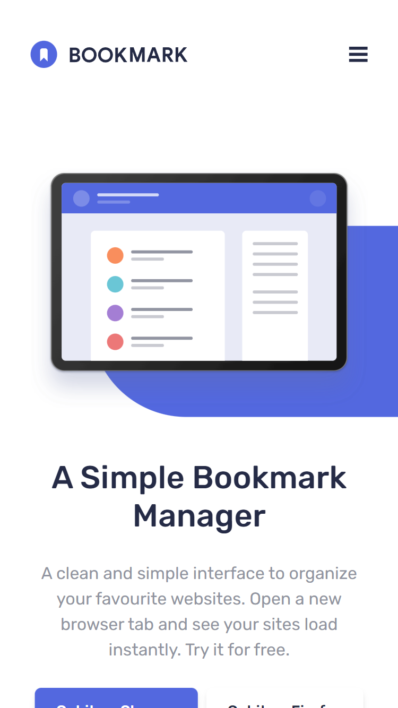
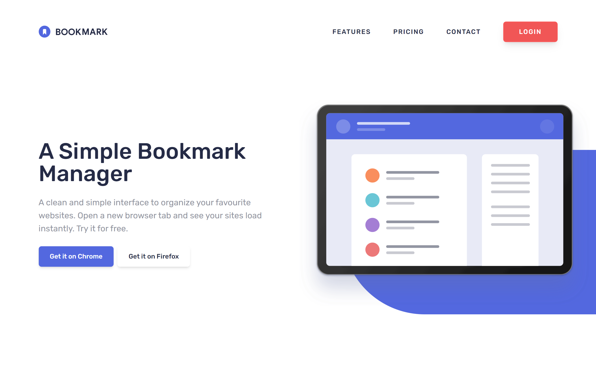

# Frontend Mentor - Bookmark landing page solution

This is a solution to the [Bookmark landing page challenge on Frontend Mentor](https://www.frontendmentor.io/challenges/bookmark-landing-page-5d0b588a9edda32581d29158). Frontend Mentor challenges help you improve your coding skills by building realistic projects. 

## Table of contents

- [Overview](#overview)
  - [The challenge](#the-challenge)
  - [Screenshot](#screenshot)
  - [Links](#links)
- [My process](#my-process)
  - [Built with](#built-with)
  - [What I learned](#what-i-learned)
  - [Continued development](#continued-development)
- [Author](#author)


## Overview

### The challenge

Users should be able to:

- View the optimal layout for the site depending on their device's screen size
- See hover states for all interactive elements on the page
- Receive an error message when the newsletter form is submitted if:
  - The input field is empty
  - The email address is not formatted correctly

### Screenshot

#### Mobile View



#### Desktop View



### Links

- Solution URL: [https://github.com/sezaru-dev/bookmark-landing-page](https://your-solution-url.com)
- Live Site URL: [https://bookmark-landing-page-cb.netlify.app/](https://your-live-site-url.com)

## My process

### Built with

- HTML5
- CSS
- Mobile-first workflow
- React-Hook-Form
- [React](https://reactjs.org/) - JS library
- [Vite.js](https://vitejs.dev/) - JS Development Tool
- [TailwindCSS](https://tailwindcss.com/) - CSS Framework


### What I learned
1. React-Hook-Form and Yup for form validation.

```js
   import {useForm} from 'react-hook-form'
   import {yupResolver} from '@hookform/resolvers/yup'
   import * as yup from 'yup'
```
```js
   const schema = yup.object().shape({
      email: yup.string().email("Whoops, Make sure it's an email").required("Please enter your email"),
   })

   const {register, handleSubmit, formState: {errors}} = useForm({
      resolver: yupResolver(schema)
   })

   const onSubmit = (data) => {
      console.table(data);
   }
```
```jsx
   <form role='form' className="flex flex-col sm:flex-row gap-6 mt-8 max-h-fit" onSubmit={handleSubmit(onSubmit)}>
      <div className=" flex flex-col flex-1">
         <input type="email" placeholder="Enter your email address" className={`text-dark-blue outline-none flex-1 px-4 py-3 rounded-md z-10 ${errors.email?.message.length? 'border-2 border-soft-red' : 'border-white'}`} {...register("email")}/>
         <small className={`bg-soft-red text-white italic text-xs px-2 py-1 pt-2.5 -mt-2 rounded-b-md z-0 ${errors.email?.message.length? 'block' : 'hidden'}`}>{errors.email?.message}</small>
      </div>

      <button className="btn h-14 bg-soft-red border-2 border-soft-red hover:bg-white hover:text-soft-red focus:bg-white focus:text-soft-red active:bg-white active:text-soft-red">Contact Us</button>
   </form>
```
2. Using percentage to make the absolute elements responsive.
```html
   <div className='absolute top-[24%] left-[18%] -z-10 rounded-l-full bg-soft-blue h-[80%] w-screen'/>
```


### Continued development

Use this section to outline areas that you want to continue focusing on in future projects. These could be concepts you're still not completely comfortable with or techniques you found useful that you want to refine and perfect.

- Become more comfortable with React Fundamentals
- Creating Scalable React Link Components
- Creating style of Scalable Tab Component
- Add some animation when the accordion is opened or closed
- Being able to implement Animate-on-scroll
- Become comfortable and fast in executing design to code 


## Author

Frontend Mentor - [sezaru-dev](https://www.frontendmentor.io/profile/sezaru-dev)

